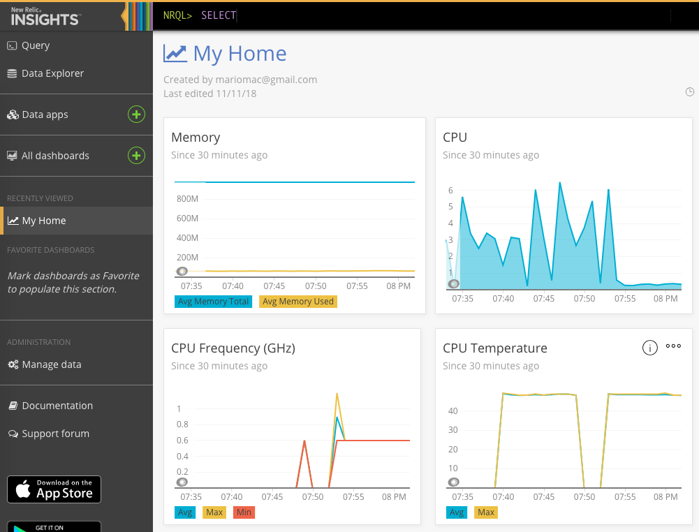

# IoT Agent for New Relic Insights

Personal project (still in a very very early stage, just a proof of concept), to run an agent inside
a Raspberry Pi that communicates with remote integrations (in Arduinos and other low-capacity devices).

This project is being built exclusively with information available in the [New Relic Custom Events
Documentation](https://docs.newrelic.com/docs/insights/insights-data-sources/custom-data/send-custom-events-event-api).

**Disclaimer**: this is just a personal proof of concept. Neither me nor New Relic provide support
for the code in this repository. If you want to use a mature, solid, and supported software, please
use the [New Relic Infrastructure Agent](https://docs.newrelic.com/docs/infrastructure/new-relic-infrastructure).

## Objectives of the project

Apply the knowledge I acquired working at [New Relic](http://www.newrelic.com) during the last year
to build from scratch an on-host agent that is:

* Simple and modular
* Lightweight: the agent must fit in a Raspberry Pi (even Pi Zero) and the data sources must fit in
  a few-KB arduino.
* Easily expandable
    - Plugins added as dynamic-linked libraries
    - Plugins running as separate services (even in remote devices) that communicate with common
      protocols: HTTP, MQTT, JSON, Avro...
    - User-provided scripting (LUA?)
* Portable: diverse models of Raspberryes, PCsgit c, etc...

## User and developer documentation

**to do**

At the moment, this is just a proof of concept.

## Screenshot

New Relic Insights showing information from my Raspberry:

* CPU %
* CPU temperature
* CPU Frequency
* Memory status

